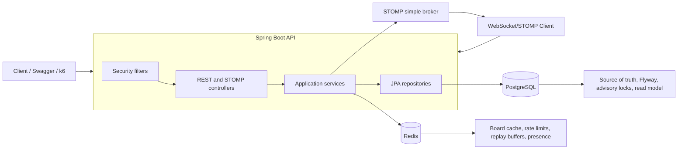
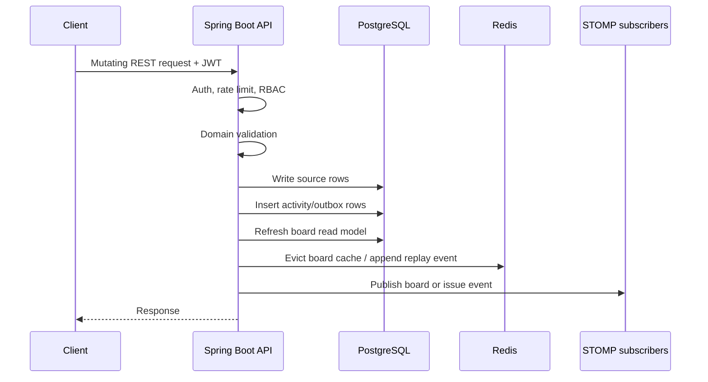

# Architecture Overview

## Goals

The backend is a Jira-like project management API focused on correctness under concurrent work, predictable local setup, and clear extension points.

Primary goals:

- Issue tracking with workflow transitions and optimistic locking
- Sprint planning, start, completion, and selective carry-over
- Collaboration through comments, mentions, watchers, notifications, and activity feed
- Real-time board updates with reconnect replay
- RBAC and rate limiting
- Read-optimized board query path
- Automated test and load validation evidence

## Runtime Components



## Package Structure

The codebase uses a modular monolith layout by capability:

- `issue`: issue APIs, workflow transitions, board reads, search
- `sprint`: sprint lifecycle, carry-over, advisory-lock guarded operations
- `collaboration`: comments, mentions, watchers, notifications, activity feed
- `realtime`: WebSocket events, replay, presence
- `customfield`: project-scoped custom field definitions and issue values
- `project`: sensitive project administration APIs
- `events`: asynchronous outbox dispatcher
- `security`: JWT, RBAC, rate limiting
- `infrastructure.persistence`: JPA entities and repositories
- `common`: errors, filters, shared API behavior
- `config`: Spring configuration

## Request Flow

Typical mutation flow:

1. Security filters authenticate the bearer token and apply rate limiting.
2. Controller checks RBAC through `RbacService`.
3. Application service validates request, version, workflow, sprint, or membership rules.
4. JPA writes source-of-truth rows in PostgreSQL.
5. Activity and outbox rows are recorded.
6. Read model and Redis cache are refreshed or invalidated.
7. Real-time event is published to STOMP topics and replay buffers.



## Storage Responsibilities

PostgreSQL:

- Source-of-truth relational data
- Workflow statuses and transitions
- Issues, sprints, comments, watchers, notifications
- Activity log and domain outbox
- Board read model
- Advisory transaction locks for sprint lifecycle serialization

Redis:

- Rate-limit counters
- Board response cache
- WebSocket replay lists
- Presence/session state

## Reliability Choices

- Issue updates use optimistic version checks and return `409 Conflict` for stale clients.
- Sprint start and completion use PostgreSQL advisory transaction locks.
- WIP-limited workflow moves lock the target workflow status row before counting issues.
- Notifications are queued before delivery attempts, so board operations continue if delivery fails.
- Notification delivery is behind a port interface and retry worker; the circuit opens after five consecutive delivery failures.
- Domain outbox rows are drained by a scheduled dispatcher and marked processed after publish.
- Real-time delivery is best effort; replay buffers and activity rows are recovery paths.

## Deployment Shape

Local submission deployment:

```text
docker compose
  - pm-api
  - pm-postgres
  - pm-redis
```

Production-oriented deployment:

```text
Load balancer
  -> multiple API instances
       -> shared PostgreSQL primary
       -> shared Redis
       -> external metrics/logging
```
