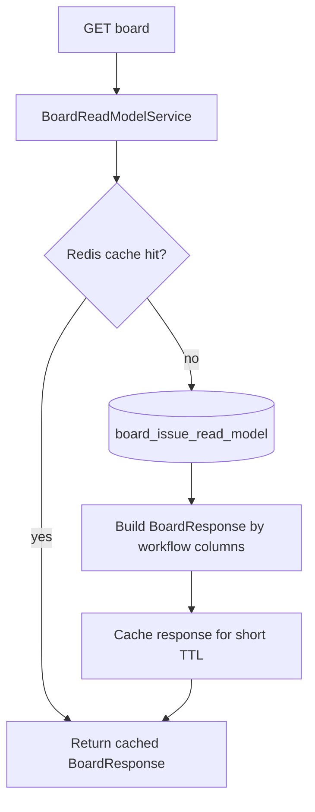
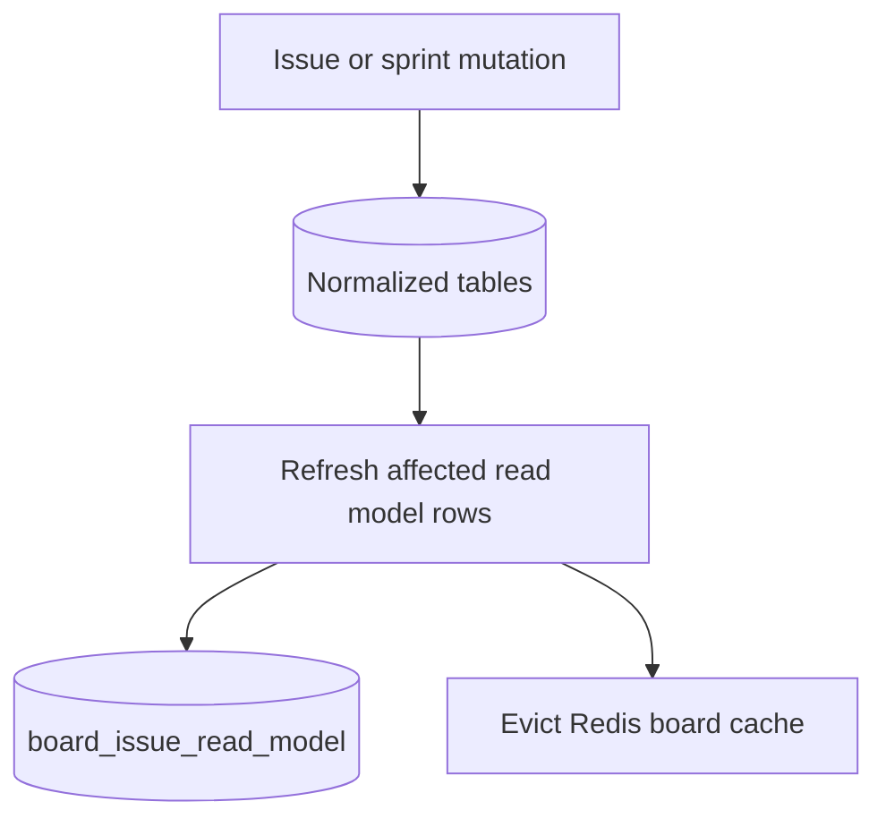

# CQRS And Board Read Model

## Problem

The board is a high-read endpoint. It needs issue, status, assignee, reporter, sprint, and ordering data in one response.

Reading directly from normalized tables on every board request would repeatedly join hot tables.

## Decision

Use a CQRS-style read model:

- command-side writes update normalized source tables
- command-side services refresh affected read-model rows
- board reads query `board_issue_read_model`
- Redis caches final board responses briefly

## Read Path

## Write Path

## Read Model Contents

`board_issue_read_model` stores denormalized issue data needed for board rendering:

- issue ID and key
- project ID
- type, title, description, priority, version
- status ID, status name, status position
- assignee ID/name
- reporter ID/name
- sprint ID/name/status
- story points
- parent issue key
- issue timestamps
- projection timestamp

## Cache Strategy

Cache key:

- `board:project:{projectId}`

Behavior:

- board read checks Redis first
- cache TTL is short, currently 30 seconds
- issue/sprint mutations evict affected project board cache
- cache failures are ignored because the read model remains authoritative

## Fallback Strategy

If the read model is empty, the service falls back to canonical issue queries.

This supports:

- new environments during startup
- recovery if read model rows are missing
- local development after manual data changes

## Metrics

Metrics exposed through actuator/Prometheus:

- `board.read.latency`
- `board.read_model.refresh.latency`

## Tests

Coverage includes:

- board cache avoids read-model query on cache hit
- integration board query returns seed workflow columns and issues
- k6 100 concurrent board viewers with p95 below target

