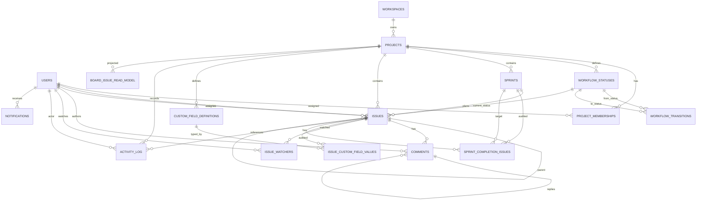

# Data Model And ERD

## Core Entities

Supporting standalone tables:

- `domain_event_outbox`
- `idempotency_keys`

## Important Tables

`issues`

- Stores issue key, title, description, type, priority, status, assignee, reporter, sprint, story points, parent, and optimistic `version`.
- Has a generated PostgreSQL `search_vector` for title and description search.
- Uses `version` for stale update detection.

`workflow_statuses`

- Stores ordered workflow columns.
- Includes `category` and optional `wip_limit`.

`workflow_transitions`

- Stores allowed status moves per project.
- `action_config` supports transition actions, currently reviewer assignment on review.

`sprints`

- Stores planned, active, and completed sprints.
- Enforces one active sprint per project through a partial unique index.
- Stores completed and carried-over story point totals.

`sprint_completion_issues`

- Audit table for sprint completion outcomes.
- Outcomes include `completed`, `carried_over`, and `moved_to_backlog`.

`comments`

- Supports threaded comments through `parent_comment_id`.
- Has generated PostgreSQL full-text search vector.

`notifications`

- Stores pending or delivered notification records.
- Used as a durable queue for mention and watcher notifications.

`activity_log`

- Append-only activity feed for issue and sprint events.
- Supports cursor pagination and filters.

`domain_event_outbox`

- Stores domain event payloads for durable event processing.
- Current implementation writes outbox records and publishes real-time events synchronously.

`board_issue_read_model`

- Denormalized board projection used by `GET /api/v1/projects/{projectId}/board`.
- Refreshed on issue and sprint mutations.

## Constraints And Indexes

Important constraints:

- one active sprint per project through `idx_sprints_one_active_per_project`
- membership role check constraint
- issue type and priority check constraints
- sprint status and date range check constraints
- workflow status category check constraint
- notification status check constraint

Important query indexes:

- `idx_issues_project_status`
- `idx_issues_sprint`
- `idx_comments_issue_created`
- `idx_comments_search`
- `idx_activity_project_created`
- `idx_board_issue_read_model_project_status`
- `idx_board_issue_read_model_project_updated`

## Seed IDs

Project:

- `00000000-0000-0000-0000-000000000201`

Users:

- Admin: `00000000-0000-0000-0000-000000000101`
- Lead: `00000000-0000-0000-0000-000000000102`
- Member: `00000000-0000-0000-0000-000000000103`
- Viewer: `00000000-0000-0000-0000-000000000104`

Seed issues:

- `PROJ-1`
- `PROJ-2`
