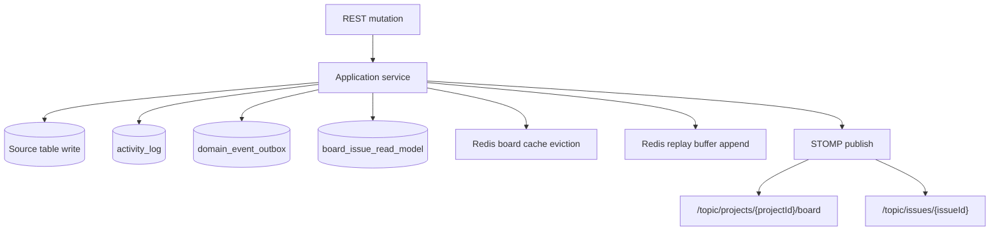
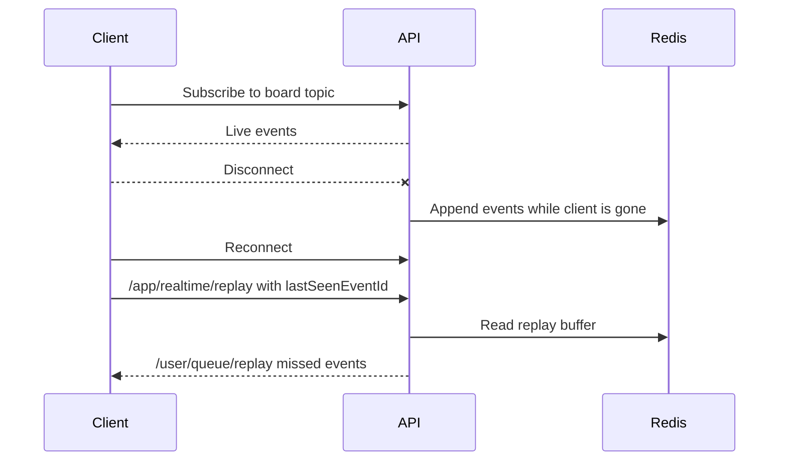

# Event-Driven Flow

## Purpose

The system records domain activity durably and also emits real-time updates for interactive board clients.

Events support:

- activity feed
- notification queueing
- WebSocket board/issue updates
- missed-event replay
- asynchronous outbox processing

## Mutation Event Flow

## Event Producers

Issue service emits events for:

- `IssueCreated`
- `IssueUpdated`
- `StatusChanged`

Sprint service emits events for:

- `SprintCreated`
- `SprintUpdated`
- `SprintStarted`
- `SprintCompleted`

Collaboration service emits events for:

- `CommentAdded`

## Client Event Types

Internal event names are mapped to client event types:

| Internal event | Client event |
| --- | --- |
| `IssueCreated` | `issue_created` |
| `IssueUpdated` | `issue_updated` |
| `StatusChanged` | `issue_moved` |
| `CommentAdded` | `comment_added` |
| `SprintCreated` | `sprint_updated` |
| `SprintUpdated` | `sprint_updated` |
| `SprintStarted` | `sprint_updated` |
| `SprintCompleted` | `sprint_updated` |

## Activity Feed

`activity_log` is the durable user-facing feed.

Endpoint:

- `GET /api/v1/projects/{projectId}/activity`

Supported filters:

- cursor
- actor
- issue
- event type
- date range
- limit

## Notifications

Notification records are created before delivery attempts and delivered through a `NotificationDeliveryPort`.

This means:

- board and issue operations can continue if notification delivery fails
- notification records remain queryable through the API
- a retry worker can retry failed or pending records
- a circuit breaker opens after five consecutive delivery failures

## Outbox

`domain_event_outbox` is written in the same mutation path as source data.

Current scope:

- rows are persisted
- real-time publish happens synchronously for low-latency clients
- background dispatcher polls unprocessed rows, republishes the durable event, and marks `processed_at`
- the dispatcher is a local worker in this modular monolith; a message broker can replace it later

## Replay Flow

